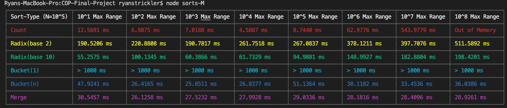
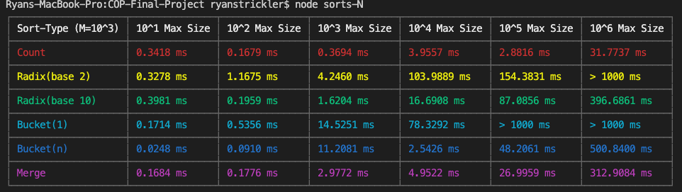

# COP-Final-Project

## About

This application examines the runtimes of different sorting algorithms. Some sorting algorithms under certain conditions can run in linear time and outperform sorts that run in log-linear time. We wanted to examine sorts under different conditions to see when these scearios would occur. We look at two varying factors: the size of the array itself, and the range of possible values for the array elements.

## How to Use

For this application, you will need to install [NodeJS](https://nodejs.org/en/download/). This project is a CLI application that has two modes.

1. Sorts with varying maximum ranges. This mode can be executed by running `node sorts-M`. This will display a table that examines the runtimes of different sorting algorithms processing arrays of 100k elements with varying ranges (from 10^1 to 10^8).

2. Sorts with varying array sizes. This mode can be executed by running `node sorts-N`. This will display a table that examines the runtimes of different sorting algorithms processing arrays with element values ranging from 0-1000 with varying sizes (from 10^1 to 10^6).

## Authors

* Ryan Strickler
* Jesse Prilutsky
* Andrew Zelenski